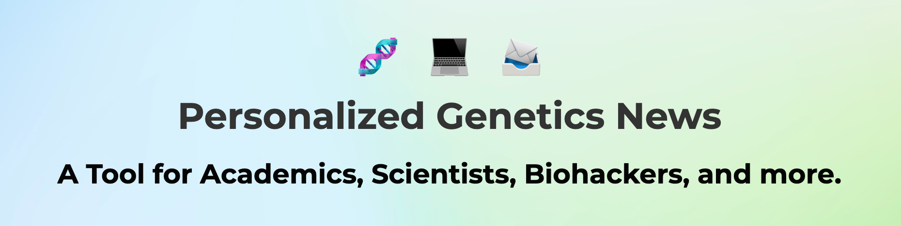

# Projects

## [GeneticUpdates.com](https://www.geneticupdates.com)

### Empowering individuals with research news tailored to their DNA.

Using a low-code tech stack of Webflow & Airtable built a website and service that keeps people up to date with research. Inspired by the lack of actionable health insights received from my 23&Me DNA test, I found online tools such as CodeGen.eu and Promethease.com for understanding the minutia of my genetic aberrations. I found myself uploading my DNA frequently to see if any changes has occured, and built a service that would make this process more convenient for others like me.

## [Abx-Effects.com](https://www.abx-effects.com)
### Adverse Antibiotic Effects in Lyme Disease Treatment

A substantial number of people are currently struggling with these zoonotic, tickborne infections. Many do not recover in the manner that medical professionals expect, leaving them searching for relief from their unrelenting symptoms. I explored this phenonemon with various data visualizations and Monte Carlo simulations. 

## [Phishing Classifier](https://ronanchance.github.io/Data-410/Project7.html)
### Phishing for a Model - An Applied Machine Learning Journey

Machine learning project where I trained a variety of models (Random Forest, Adaboost, XGBoost, and LightGBM) on URLs with the goal of classifying into benign, defacement, phishing, and malware. The initial phase consisted of creative feature extraction where I came up with a variety of metrics to calculate given a link, such as keeping track of special characters, digits, letters, url shortening, capital to lowercase ratio, etc. Ultimately produced an XGBoost model with high accuracy and sensitivity. 